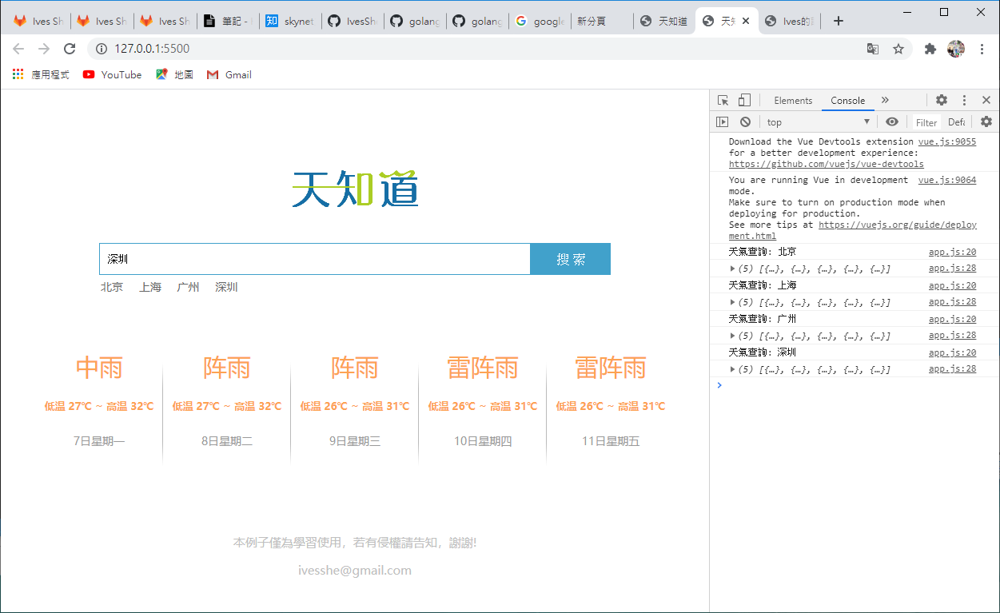

# Vue_Weather

因為有跨域的問題，若無法使用，可直接下載直接運行index.html

[示範網站](https://ivesshe.github.io/Vue_Weather/)

# Vue + axios

Vue

https://cdn.jsdelivr.net/npm/vue/dist/vue.js

Axios

https://unpkg.com/axios/dist/axios.min.js

# 執行畫面

